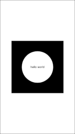
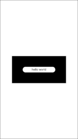
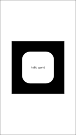
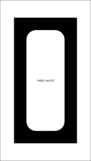
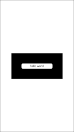

react-native-rounded-view
=========================

**A React Native View that defines its border radius by percentage**

React Native offers the [`borderRadius` style
prop](https://reactnative.dev/docs/view-style-props#borderradius) to define the
border radius of a component. However, this prop does not accept percentage
values.

The `RoundedView` React Component is a `View` that defines its border radius by
percentage and has `overflow: 'hidden'`. It is particularly useful to create a
view with circular shape.

Please note that this is not equivalent to the the [`border-radius` CSS
property](https://developer.mozilla.org/en-US/docs/Web/CSS/border-radius),
because the calculations consider the minimum between width and height. It is
not possible to create a view with oval shape.


Peer dependencies
-----------------

``` json
{
    "react": "^17.0.1",
    "react-native": ">=0.64.3"
}
```


Install
-------

With npm:

```
npm install @hashiprobr/react-native-rounded-view
```

With yarn:

```
yarn add @hashiprobr/react-native-rounded-view
```

If using Expo, add the module to `webpack.config.js`:

``` js
const createExpoWebpackConfigAsync = require('@expo/webpack-config');

module.exports = async function (env, argv) {
    const config = await createExpoWebpackConfigAsync({
        ...env,
        babel: {
            dangerouslyAddModulePathsToTranspile: [
                '@hashiprobr/react-native-rounded-view',
            ],
        },
    }, argv);
    return config;
};
```

If `webpack.config.js` does not exist, create it with:

```
expo customize:web
```


Props
-----

| name   | description                                                       |
|--------|-------------------------------------------------------------------|
| radius | a number representing the border radius percentage (default `50`) |

[...View props](https://reactnative.dev/docs/view#props)


Example
-------

With `radius={50}` (one half of the minimum between width and height).





With `radius={25}` (one quarter of the minimum between width and height).





Code for the first image. Notice how the white `View` has relative dimensions.

``` js
import React from 'react';

import { View, Text } from 'react-native';

import RoundedView from '@hashiprobr/react-native-rounded-view';

export default function MyComponent() {
    return (
        <View
            style={{
                flexGrow: 1,
                justifyContent: 'center',
                alignItems: 'center',
            }}
        >
            <View
                style={{
                    width: 250,
                    height: 250,
                    padding: 50,
                    backgroundColor: '#000000',
                }}
            >
                <RoundedView
                    style={{
                        flexGrow: 1,
                        alignItems: 'stretch',
                        justifyContent: 'center',
                        alignItems: 'center',
                        backgroundColor: '#ffffff',
                    }}
                    radius={50}
                >
                    <Text>hello world</Text>
                </RoundedView>
            </View>
        </View>
    );
}
```
